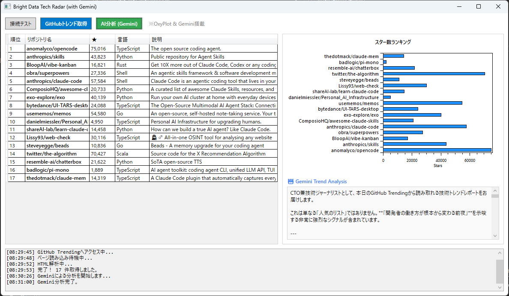

# GitHub Trending Analyzer with AI

GitHub トレンドリポジトリを自動取得し、グラフ化とAI分析を行うWPFアプリケーションです。



## 🌟 主な機能

### 1. 接続テスト
- Bright Data ISP Proxyの接続確認
- 接続元の国や地域情報を表示

### 2. GitHubトレンド取得
- GitHub Trending (Monthly) からリポジトリ情報を自動収集
- スクレイピングには Playwright + Bright Data Proxy を使用
- 取得情報:
  - リポジトリ名
  - スター数
  - 説明
  - プログラミング言語

### 3. データ可視化
- OxyPlot を使用した横向き棒グラフ
- スター数ランキングを視覚的に表示

### 4. AI トレンド分析 (Gemini API)
- Google Gemini API による高度な分析
- 技術トレンドの洞察
- カテゴリ別の詳細解説
- 開発者へのおすすめ情報

## 🛠️ 技術スタック

- **.NET 8 / C# 12.0**
- **WPF (Windows Presentation Foundation)**
- **Playwright** - ブラウザ自動化
- **OxyPlot** - グラフ描画
- **Bright Data ISP Proxy** - 安定したスクレイピング
- **Google Gemini API** - AI分析
- **Newtonsoft.Json** - JSON処理

## 📋 前提条件

- Windows 10/11
- .NET 8 SDK
- Visual Studio 2022 以降（推奨）

## 🚀 セットアップ

### 1. リポジトリのクローン

```bash
git clone https://github.com/yourusername/BrightData_WPF.git
cd BrightData_WPF
```

### 2. 必要なパッケージのインストール

プロジェクトを開くと、NuGetパッケージが自動的に復元されます。
手動でインストールする場合:

```bash
dotnet restore
```

### 3. Playwright のセットアップ

初回のみ、Playwrightのブラウザをインストール:

```bash
pwsh bin/Debug/net8.0-windows/playwright.ps1 install
```

または:

```bash
playwright install chromium
```

### 4. API キーの設定

`MainWindow.xaml.cs` の以下の定数を編集してください:

```csharp
// Bright Data 設定
private const string ProxyHost = "brd.superproxy.io:33335";
private const string Username = "brd-customer-xxxxxxxx-zone-isp_proxy1";
private const string Password = "YOUR_PASSWORD";

// Gemini API キー
private const string GeminiApiKey = "YOUR_GEMINI_API_KEY";
```

#### Bright Data の取得方法
1. [Bright Data](https://brightdata.com/) にサインアップ
2. ISP Proxy ゾーンを作成
3. 認証情報をコピー

#### Gemini API の取得方法
1. [Google AI Studio](https://makersuite.google.com/app/apikey) にアクセス
2. APIキーを作成
3. キーをコピー

## 📖 使い方

### 基本的な流れ

1. **アプリを起動**
   ```bash
   dotnet run
   ```

2. **接続テスト (オプション)**
   - 「接続テスト」ボタンをクリック
   - Bright Dataの接続が正常か確認

3. **データ取得**
   - 「GitHubトレンド取得」ボタンをクリック
   - 数十秒待つとデータが表示されます

4. **AI分析**
   - データ取得後、「AI分析」ボタンをクリック
   - Geminiがトレンドを分析し、詳細レポートを生成

### UI構成

```
┌─────────────────────────────────────────┐
│  [接続テスト] [GitHubトレンド取得]      │
├─────────────────────────────────────────┤
│  リポジトリ一覧 (DataGrid)              │
│  - Rank | Name | Stars | Language      │
├─────────────────────────────────────────┤
│  グラフ (OxyPlot)                       │
│  横向き棒グラフでスター数を表示         │
├─────────────────────────────────────────┤
│  [AI分析]                               │
│  AI分析結果 (TextBox)                   │
├─────────────────────────────────────────┤
│  ログ (TextBox)                         │
└─────────────────────────────────────────┘
```

## 🎨 カスタマイズ

### 取得期間の変更

`RunGitHubScraping()` メソッドのURL部分を変更:

```csharp
// 今日のトレンド
await page.GotoAsync("https://github.com/trending?since=daily");

// 今週のトレンド
await page.GotoAsync("https://github.com/trending?since=weekly");

// 今月のトレンド (デフォルト)
await page.GotoAsync("https://github.com/trending?since=monthly");
```

### グラフの色変更

`RunGitHubScraping()` メソッド内:

```csharp
var barSeries = new BarSeries
{
    Title = "Stars",
    StrokeThickness = 1,
    FillColor = OxyColors.Red // 色を変更
};
```

利用可能な色は `OxyColors` クラスを参照してください。

### AI分析プロンプトのカスタマイズ

`AnalyzeWithGemini()` メソッドのプロンプト部分を編集:

```csharp
sb.AppendLine("あなたはベテランの技術ジャーナリスト兼CTOです。");
// カスタムプロンプトを追加
```


## 🐛 トラブルシューティング

### Playwrightのエラー

```
Could not find browser
```

**解決策:**
```bash
playwright install chromium
```

### Bright Data接続エラー

- 認証情報が正しいか確認
- アカウントの残高があるか確認
- ゾーンが有効化されているか確認

### Gemini API エラー

```
API key not valid
```

**解決策:**
- APIキーが正しいか確認
- [Google AI Studio](https://makersuite.google.com/app/apikey) で有効なキーか確認
- APIの利用制限に達していないか確認

### グラフが表示されない

- データが正常に取得されているか確認
- ログを確認してエラーメッセージをチェック

## 📁 プロジェクト構成

```
BrightData_WPF/
├── MainWindow.xaml          # UI定義
├── MainWindow.xaml.cs       # メインロジック
├── RepositoryData.cs        # データモデル
├── App.xaml                 # アプリケーション設定
├── BrightData_WPF.csproj   # プロジェクト設定
└── README.md                # このファイル
```

## 🔒 セキュリティに関する注意

**⚠️ 重要:** 
- APIキーやパスワードをソースコードに直接書き込まない
- `.gitignore` に認証情報ファイルを追加
- 環境変数や設定ファイルを使用することを推奨

本番環境向けには、以下のような実装を検討してください:

```csharp
// appsettings.json や環境変数から読み込む
private readonly string GeminiApiKey = Environment.GetEnvironmentVariable("GEMINI_API_KEY");
```

## 📝 ライセンス

MIT License

## 🤝 コントリビューション

プルリクエストは大歓迎です！以下の手順でコントリビュートしてください:

1. このリポジトリをフォーク
2. 機能ブランチを作成 (`git checkout -b feature/AmazingFeature`)
3. 変更をコミット (`git commit -m 'Add some AmazingFeature'`)
4. ブランチにプッシュ (`git push origin feature/AmazingFeature`)
5. プルリクエストを作成

## 👨‍💻 著者

**RamTuckey**
- 🌐 Website: [https://electwork.net/](https://electwork.net/)
- 🐦 X (Twitter): [@RamTuckey](https://x.com/RamTuckey)

## 📧 お問い合わせ

質問や提案がある場合は、Issueを作成してください。

## 🙏 謝辞

- [Bright Data](https://brightdata.com/) - 安定したプロキシサービス
- [Playwright](https://playwright.dev/) - 優れたブラウザ自動化ツール
- [OxyPlot](https://oxyplot.github.io/) - 美しいグラフライブラリ
- [Google Gemini](https://ai.google.dev/) - 強力なAI分析

---

⭐ このプロジェクトが役に立ったら、スターをお願いします！
